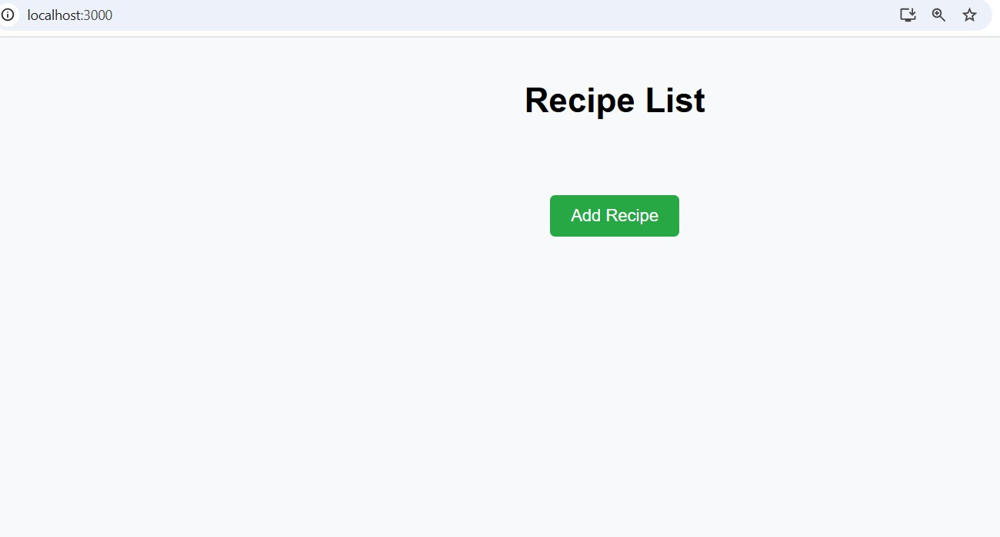
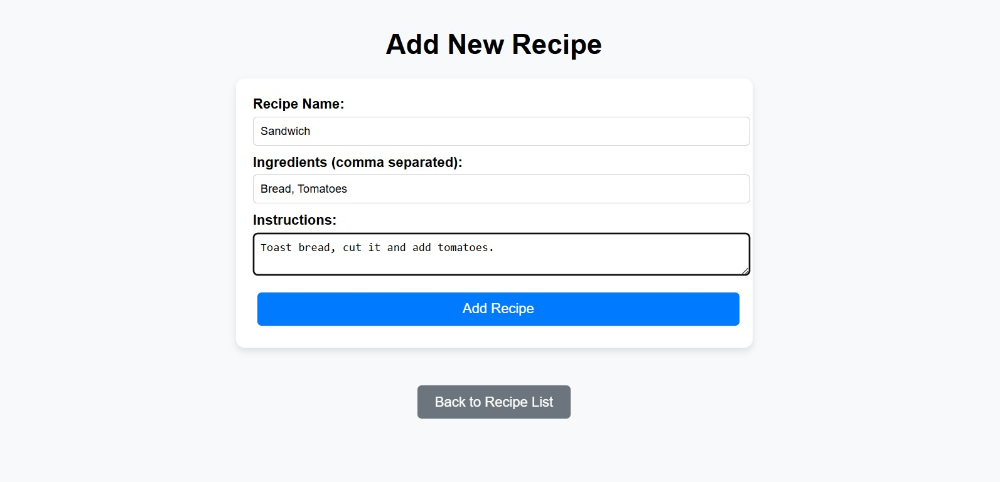
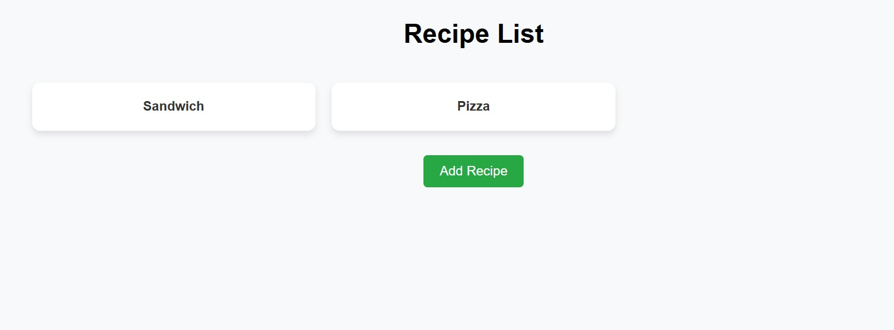
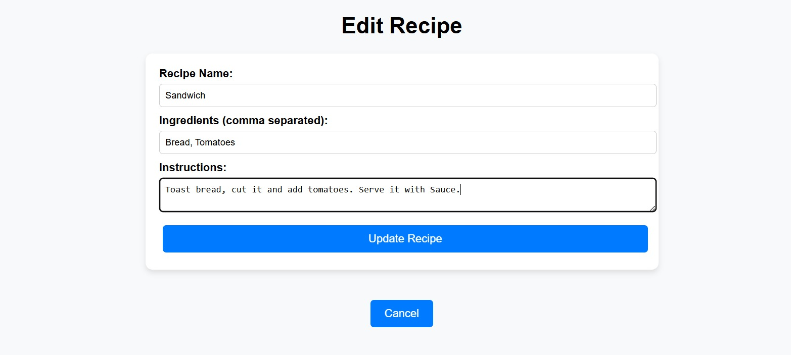
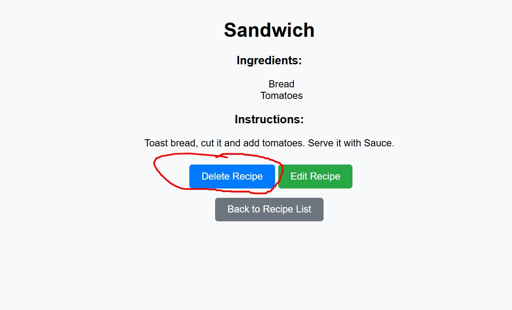
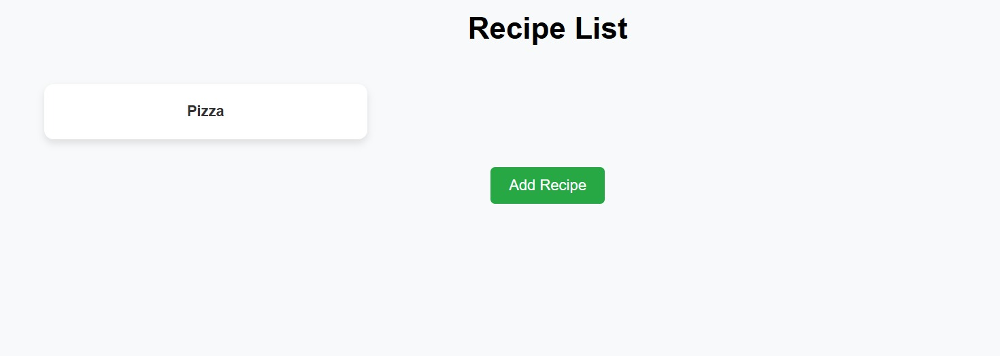

# Recipe Finder - MERN Stack App

A full-stack **Recipe Finder** application built using **MongoDB, Express.js, React, and Node.js (MERN Stack)**.  
This app allows users to **add, view, edit, and delete recipes**. 

---

## Features
**1)** View a list of recipes  
**2)** Click on a recipe to view details  
**3)** Add a new recipe with ingredients and cooking instructions  
**4)** Update existing recipes  
**5)** Delete recipes  
**6)** Styled user-friendly interface  

---

## Output Screenshots

Here are some screenshots of the application:

1. **HomePage**
   

2. **Add Recipe Page**
   

3. **Display recipes**
   

5. **Edit Recipe Page**
   

6. **Delete recipe page**
   

7.**FinalRecipe Details Page**
   


## Tech Stack

- **Frontend:** React.js (React Router, Axios)
- **Backend:** Node.js, Express.js
- **Database:** MongoDB Atlas
- **Styling:** CSS
- **API Testing:** Postman

### ** Clone the Repository**
```sh
git clone https://github.com/your-username/recipe-finder.git
cd recipe-finder

**Install required libraries**

**Setting backend**

mkdir backend
cd backend
npm init -y
npm install express mongoose dotenv cors body-parser


**Create .env**
MONGO_CONNECTION_STRING=your_mongodb_uri
PORT=5000
**Start backend**
node app.js


**Setting frontend**
npx create-react-app frontend
cd frontend
npm install axios react-router-dom
npm start
